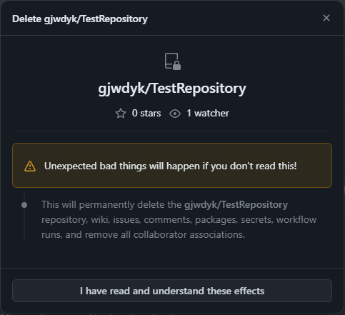

# ReFresh Repository

<br>

When you have been committing/pushing updates on your repository too many times, the history of committed updates will start to burden your local machine/unit when you're adding more commits to the repository.
Each time you need to add another commit, it takes ages and the local CPU may be highly consumed (high CPU consumptions).
One way to remove the history (i.e. Re-Fresh the Repository), so it becomes light-weight again to work on, is to Delete and Re-Create the Repository.
But before you Delete the Repository, a few matters you need to be aware-of and prepare.

This Delete and Re-Create the Repository procedure only suitable under the following conditions:
- [ ] You work alone on your repository. Do ***NOT*** do this if you collaborate with other individuals.
- [ ] You do ***NOT*** care loosing your Activities records related to the Repository, as well as the Repository's Stars, Forks, and any other types of fame/remarks others may have given to your repository. When you Delete your Repository, those will be gone.
- [ ] The below guide assumes you use GitHub Desktop on Windows OS. Although if you understand the principle, you can apply that principle to any other Git tools.


<br><br><br>

***

## Finish, Commit and Push any near-future changes or updates

It is recommended NOT to do this mid-ways in between your near-future updates (i.e. while you're actively working on the repository).
When things go wrong in this procedure, you're surely going to spend a lot of time fixing issues caused by this procedure instead of working on your repository/project; and that's against the purpose of this guide, which to speed things up and makes you work more efficient on your repository/project.


<br><br><br>

***

## Create a BackUp, a BackUp of BackUp, and BackUp of that BackUp

We will take an example repository where we apply the procedure on.
The example repository name is `TestRepository` on this `gjwdyk` GitHub account, so the repository can be referred shortly as `TestRepository` or with its complete name `gjwdyk/TestRepository`.

<br>

You can compress the whole Repository folder, and keep the compressed archive on other separate folder (which is not part of, nor accessible by GitHub Desktop).


You also can copy the whole Repository folder as is, into other separate folder (which is not part of, nor accessible by GitHub Desktop).


<br><br><br>

***

## Delete Repository from GitHub Site

<br>

Login to your GitHub account and browse to the Repository's Main Page.


<br>

Click the  tab on the top row.
Then on the "Settings" page, scroll down until you see a section labelled as "Danger Zone".

<br><br>


<br>

Click  button.

<br><br>


<br>

Click  button.

<br><br>




<br>

Click  button.

<br><br>


<br>

Fill in the provided input field box, the complete name of the Repository. In this example: `gjwdyk/TestRepository`.

<br>


<br>

Then click  button.

<br><br>


On this point, the Repository will be deleted by GitHub, along with all its related data such as Activities done on the Repository, as well as Stars, Forks and other information related to the Repository.


<br><br><br>

***

## Delete Repository from your local GitHub Desktop

<br>

At this point, if you go to your local GitHub Desktop, you will still have the above deleted repository. In this example: `TestRepository`.


And if you try to `Fetch origin` the above deleted repository, you will get error message as depicted below.


<br>

To easily delete the example repository (`TestRepository`) from GitHub Desktop, select another repository (in this example: `ReFreshRepository`) as the `Current repository`.


Click the arrow on the right of the `Current repository` rectangle, the left panel will list down all the repositories available.
Scroll down until you see the targeted repository (`TestRepository`), right-click on the targeted repository (`TestRepository`) and some options are listed for you.


Click the bottom most `Remove...` option, and you'll be asked to confirm.


Leave the `Also move this repository to Recycle Bin` unchecked.
This option usually will cause another error message.
We'll take care of the repository's folder with Windows' File Explorer separately, later.
Click the  button.

<br><br>

At this point, the reference to the targeted repository (`gjwdyk/TestRepository`) will be deleted from GitHub Desktop.
But the actual files are still persist on GitHub Desktop working directory/folder; next we'll take care of those files.


<br><br><br>

***

## Delete Repository from your local GitHub working folder

<br>

With Windows' File Explorer, navigate to GitHub Desktop working directory/folder.


Within GitHub Desktop working directory/folder, search for the targeted repository's folder, and right-click on the folder.


While holding down `shift` on the keyboard, click the `Delete` option to permanently delete the targeted folder.
You'll be asked to confirm the deletion.


Click `Yes` button to confirm the deletion.

<br><br>

At this point, the targeted repository (`gjwdyk/TestRepository`) will be completely deleted from GitHub Desktop.


<br><br><br>

***

## Re-Create Repository on GitHub Site

<br>

Now that we have completely deleted the targeted repository (`gjwdyk/TestRepository`), it is time to re-create it.
Login to your GitHub account and browse to your GitHub main page.


<br>

Click at the  tab on the top row menus.
The number on the right-side of the tab is the number of repositories currently exist on the GitHub account.
So this number most probably will be different in your case.

<br><br>


<br>

On the "Repositories" page, click the  button to create a new repository (re-create the targeted repository `gjwdyk/TestRepository`).

<br><br>


<br>

Input the repository name exactly the same as the previously deleted target repository (in this example `TestRepository`).
Optionally, you may want to select `Add a README file`.

<br>


<br>

Click the  button to initiate the creation of the new repository (i.e. re-creation of the targeted repository `gjwdyk/TestRepository`).
Once the re-creation finished, you'll be shown the newly (re)created repository.

<br>


<br><br>

At this point, you'll have a new empty repository with the exact same name as before, on the GitHub site.
Next we need to configure the GitHub Desktop to synchronize with the GitHub site, on the newly (re)created target repository.


<br><br><br>

***

## Re-Clone Repository on your local GitHub Desktop

<br>

After the repository is created on the GitHub site, the GitHub Desktop needs to be synchronized with the newly (re)created repository (`gjwdyk/TestRepository`).

<br>


<br>

On the GitHub Desktop, click the arrow on the right of the `Current repository` rectangle.

<br>


<br>

Aside of the list of currently available repositories, right below the `Current repository` rectangle, there are `Filter` input-box and `Add` dropdown-selection box.
Click the `Add` dropdown-selection box, and click on the `Clone repository...` option.

<br>


<br>

Fill in the newly (re)created repository name on the provided filter input box `TestRepository`, and the available repository on the GitHub site will be short-listed below the filter input box.
Click to select on the short-listed target repository on the GitHub site `gjwdyk/TestRepository`, and then click  button.

<br>


<br>

The `TestRepository` will be synchronized between GitHub site and GitHub Desktop.
A new folder will be created specific for this newly (re)synchronized repository.
If the old/previous folder exist and not empty, the "clone" process fill fail.

<br><br>

At this point, the target repository is synchronized between GitHub site and GitHub Desktop, but the newly (re)created repository is still empty.
Next we will (re)populate the repository with the files from the BackUp, but without any of the `.git` information which burden your local machine.


<br><br><br>

***

## Restore Repository's files on to your local GitHub working folder

<br>

With Windows' File Explorer, navigate to GitHub Desktop working directory/folder, and into the `TestRepository` folder.
We can see the newly (re)created `TestRepository` folder contains a newly (re)created `README.md` file and a newly (re)created `.git` folder.

<br>


<br>

Navigate to the previously created `TestRepository` BackUp directory/folder.

<br>


<br>

Copy all the contents of the `TestRepository` BackUp directory/folder, into the newly (re)created GitHub Desktop `TestRepository` folder, ***EXCEPT*** for the `.git` folder (we do ***NOT*** want the old `.git` folder in this case).

<br>


<br>

We will replace the newly (re)created `README.md` file with the one from the BackUp, but we want to use the newly (re)created `.git` folder.

<br>


<br><br>

Now that we have (re)populate the `TestRepository` folder, GitHub Desktop will see this as if we magically manage to develop all the contents (files and sub-folders from the BackUp) in short time.
So what's left is to commit and push the "(re)developed" contents to the GitHub.


<br><br><br>

***

## Commit and Push the restored files on to GitHub Site

<br>

Once you have copied the contents from the BackUp, you can see GitHub Desktop shows the difference between the last state (newly created repository), with the current state (with all of the contents).

<br>


<br>

Do the commit for all the new contents, and push them to GitHub site.

<br>


<br>

Now you'll have a ReFreshed Repository, with only two history points.
You can continue to develop your project/repository, but now the high latencies and high CPU consumptions during commit and push should be gone.


<br><br><br>

***

<br><br><br>
```
╔═╦═════════════════╦═╗
╠═╬═════════════════╬═╣
║ ║ End of Document ║ ║
╠═╬═════════════════╬═╣
╚═╩═════════════════╩═╝
```
<br><br><br>


